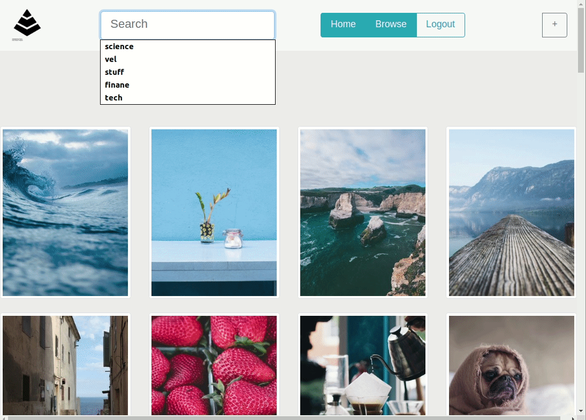
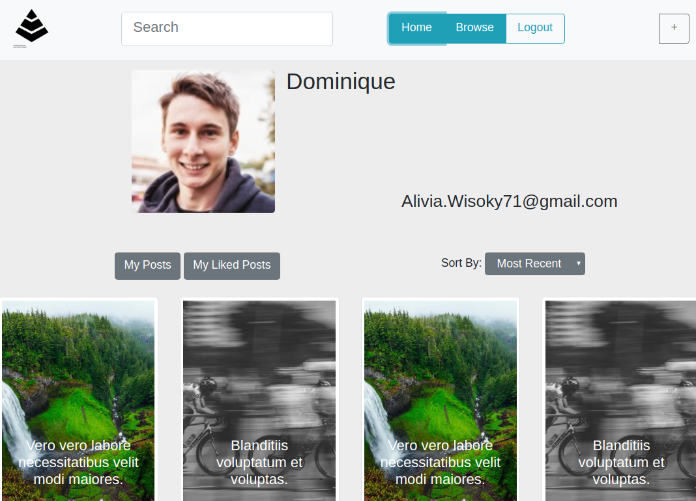
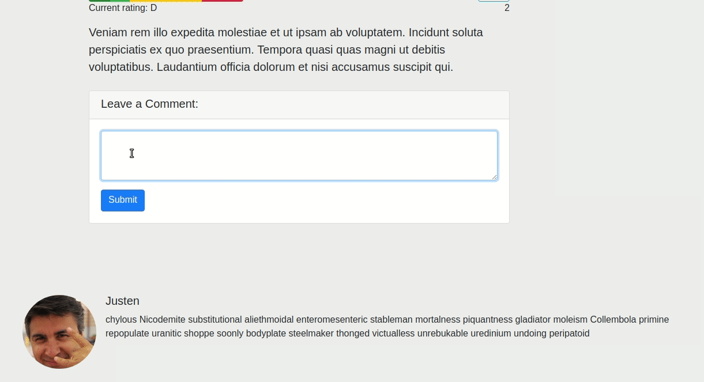
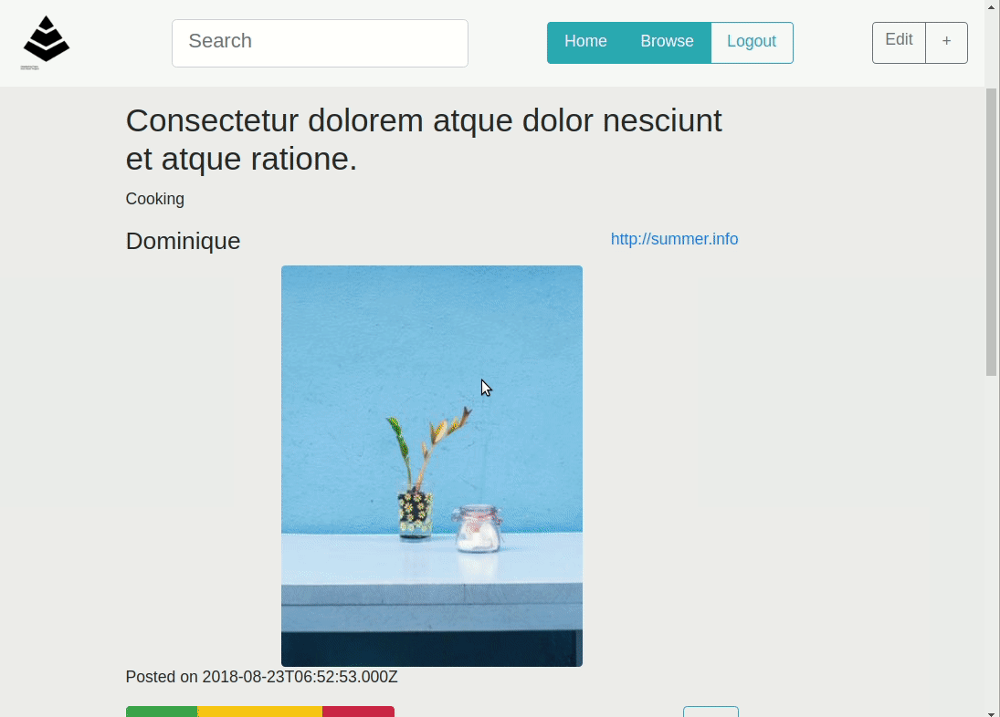

# Tut Bucket

Full stack web app built with Node, Express, PostgreSQL, jQuery and Bootstrap. It allows learners to save learning resources like tutorials, blogs and videos in a central place that is publicly available for any user.

## Final Product

Tut Bucket allows people to search for resources posted by other users as well as browse them by categories. They can view a single resource, post comments, like and rate resources. Users can create, edit and delete resources. They can view the resources they posted and liked.

*Search for resources*

*User's home page*

*Commenting and liking*

*Delete a resource from the edit form*

## Getting Started

Fork this repository, then clone your fork of this repository. Install dependencies using the npm install command. Start the web server using the npm start command. The app will be served at http://localhost:8080/.

## USER STORIES
  - As a user, I should be able to save an external URL along with a title and description, because I want others to see how cool I am and I found it useful.
  - As a user, I should be able to search for already saved resources created by any user, because I'm looking for new resources for what I'm interested in.
  - As a user, I should be able to categorize any resource under a topic, because it makes finding those resources easier.
  - As a user, I should be able to comment on any resource, because I want to voice my opinion.
  - As a user, I should be able to rate any resource, because I want to be a part of deciding whether something is actually useful.
  - As a user, I should be able to like any resource, because I want to keep track of what I like or found interesting.
  - As a user, I should be able to view all my own and all liked resources on one page ("My resources"), because it makes looking for resources easier.
  - As a user, I should be able to register, log in, log out and update my profile, because it helps me track my resources, and I don't want other people to change my resources.

## USER SCENARIOS
  - Given that I've found something interesting online, when I fill out a form and submit it, then it will save the resource on my account and on my page.
  - Given that I'm curious about an interest, when I enter a search in the search bar, then results are displayed or categories are provided (optional data-list dropdown).
  - Given that I am creating or updating a URL, when I pick a category from the drop down list and click save, then my URL will be associated with that category.
  - Given that I have something to say, when I fill out the comment form and submit it, then my comment will be displayed under that resource.
  - Given that I am viewing a resource, when I choose a letter grade for that resource, then the average of all ratings are displayed as a letter grade next to that resource.
  - Given that I like what I'm viewing, when I click the like button, then the number of likes on that resource will be incremented and the button will change to show that I've clicked it.
  - Given that I visit my own page, when my page is displayed, then both categories (my resources, and all liked resources) will be displayed.
  - Given that I want to sign up for this app, when I click the register button, then I'm taken to a form to fill out and submit, then I will have an account.
  - Given that I have an account and want to log in, when I click the login button and provide my credentials, then I am redirected to my page.

## Dependencies

- Node
- NPM
- express 
- express-session 
- PostgreSQL
- jQuery 
- body-parser
- cookie-parser
- dotenv 
- ejs 
- knex 
- knex-logger 
- morgan 
- node-sass-middleware 
- pg 